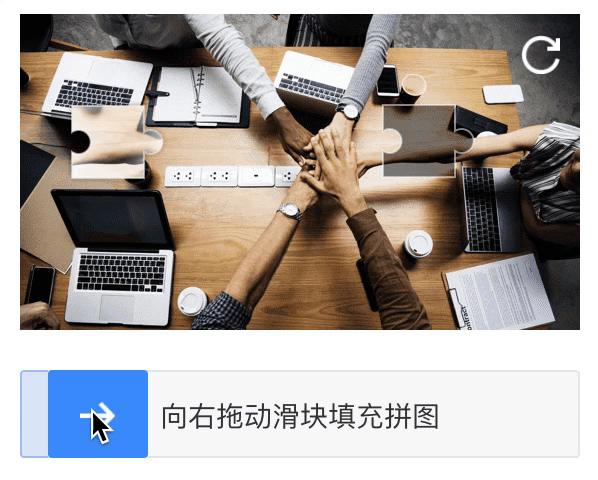

# Solving problem



# download model weight
```
  wget
https://machinelearning-models-public.oss-cn-beijing.aliyuncs.com/tiny-obj_120000.weights -P /applicaton/weights/

```
# build images
```
 docker build -t crack-captcha .
```

# run service
```
  docker run  -d --name crack-container  -p 8008:5000 crack-captcha
```
